# Index Condition Pushdown (ICP)

Index Condition Pushdown (ICP) is a MySQL optimization that pushes down parts of a `WHERE` clause to the storage engine.

This allows the storage engine to use an index to filter rows, reducing the number of rows that need to be returned to the server.

## How it works

1.  The server sends the part of the `WHERE` clause that can be evaluated only by the index to the storage engine.
2.  The storage engine uses the index to retrieve records.
3.  The storage engine evaluates the pushed-down `WHERE` condition.
4.  Only records that match the condition are sent back to the server.

This can significantly improve query performance by reducing the amount of data transferred between the storage engine and the server.

## Visual Explanation (Flowchart)

Here is a visual comparison of the process with and without Index Condition Pushdown.

### Without ICP (Inefficient Flow)

Without ICP, the storage engine sends all data matching the first part of the index (`last_name = 'Doe'`) to the server, which then does the second round of filtering.

```mermaid
graph TD
    subgraph MySQL Server
        A[1. Query Received<br/>WHERE last_name = 'Doe'<br/>AND first_name LIKE '%J%'] --> B{2. Command to Storage Engine};
        B --> C["Get all records where<br/>'last_name = Doe'"];
        E[4. Data Received<br/>&#40;All 'Doe' records, e.g., 100 rows&#41;] --> F{5. Filter by<br/>first_name LIKE '%J%'};
        F --> G[6. Return results<br/>&#40;e.g., 5 rows&#41;];
    end

    subgraph Storage Engine
        D[3. Use index to find 'Doe' records,<br/>send all 100 rows to server];
    end

    C --> D;
    D --> E;
```

### With ICP (Efficient Flow)

With ICP, the filtering condition (`first_name LIKE '%J%'`) is "pushed down" to the storage engine. The storage engine filters the data, so only the necessary data is sent to the server.

```mermaid
graph TD
    subgraph MySQL Server
        A[1. Query Received<br/>WHERE last_name = 'Doe'<br/>AND first_name LIKE '%J%'] --> B{2. Command to Storage Engine};
        B --> C["Get records using both conditions:<br/>'last_name = Doe'<br/>AND 'first_name LIKE %J%'"];
        E[4. Data Received<br/>&#40;Already filtered data, e.g., 5 rows&#41;] --> F[5. Return results<br/>&#40;e.g., 5 rows&#41;];
    end

    subgraph Storage Engine
        D[3. Use index for 'last_name = Doe',<br/><b>and also filter using 'first_name LIKE %J%'.</b><br/>Send only matching 5 rows to server.];
    end

    C --> D;
    D --> E;
```

### Summary

-   **Without ICP**: Unnecessary data is sent to the server first, and then filtered (e.g., 100 rows are sent).
-   **With ICP**: Data is fully filtered at the data layer, and only the required data is sent to the server (e.g., only 5 rows are sent).

This "pushdown" of the filtering logic reduces data transfer and improves performance.

---

# 【日本語版】Index Condition Pushdown (ICP)

Index Condition Pushdown（ICP）は、`WHERE`句の一部をストレージエンジンに「プッシュダウン（押し込む）」するMySQLの最適化機能です。

これにより、ストレージエンジンがインデックスを使いながら行をフィルタリングできるようになり、サーバーに返す必要のある行数を減らすことができます。

## 仕組み

1.  サーバーは、インデックスだけで評価できる`WHERE`句の条件部分をストレージエンジンに送ります。
2.  ストレージエンジンは、インデックスを使ってレコードを取得します。
3.  ストレージエンジンは、プッシュダウンされた`WHERE`条件を評価します。
4.  条件に一致したレコードだけがサーバーに返されます。

これにより、ストレージエンジンとサーバー間で転送されるデータ量が大幅に削減され、クエリのパフォーマンスが向上します。

## 図による解説（フローチャート）

ICPが「ある場合」と「ない場合」の処理の流れを視覚的に比較します。

### ICPがない場合（非効率な流れ）

ICPがない場合、ストレージエンジンはインデックスの最初の部分（`last_name = 'Doe'`）に一致するデータをすべてサーバーに送信し、サーバーが2回目のフィルタリングを行います。

```mermaid
graph TD
    subgraph MySQLサーバー
        A[1. クエリ受信<br/>WHERE last_name = 'Doe'<br/>AND first_name LIKE '%J%'] --> B{2. ストレージエンジンに命令};
        B --> C["'last_name = Doe' の<br/>データをすべて取得せよ"];
        E[4. データ受信<br/>&#40;'Doe'の全データ, 例: 100件&#41;] --> F{5. first_name LIKE '%J%'<br/>でフィルタリング};
        F --> G[6. 結果を返す<br/>&#40;例: 5件&#41;];
    end

    subgraph ストレージエンジン
        D[3. インデックスを使い 'Doe'の<br/>データを探し、100件すべてを<br/>サーバーに送信];
    end

    C --> D;
    D --> E;
```

### ICPがある場合（効率的な流れ）

ICPがある場合、フィルタリング条件（`first_name LIKE '%J%'`）がストレージエンジンに「プッシュダウン」されます。ストレージエンジンがデータをフィルタリングするため、必要なデータだけがサーバーに送信されます。

```mermaid
graph TD
    subgraph MySQLサーバー
        A[1. クエリ受信<br/>WHERE last_name = 'Doe'<br/>AND first_name LIKE '%J%'] --> B{2. ストレージエンジンに命令};
        B --> C["両方の条件でデータを取得:<br/>'last_name = Doe'<br/>AND 'first_name LIKE %J%'"];
        E[4. データ受信<br/>&#40;フィルタリング済みデータ, 例: 5件&#41;] --> F[5. 結果を返す<br/>&#40;例: 5件&#41;];
    end

    subgraph ストレージエンジン
        D[3. 'last_name = Doe'で<br/>インデックスを使い、<br/><b>さらに'first_name LIKE %J%'で<br/>フィルタリング。</b><br/>一致した5件のみサーバーに送信];
    end

    C --> D;
    D --> E;
```

### まとめ

-   **ICPなし**: 不要なデータも一度サーバーに送られてから絞り込まれる（例：100件が送信される）。
-   **ICPあり**: データ層で完全に絞り込まれた、本当に必要なデータだけがサーバーに送られる（例：5件だけが送信される）。

このように、フィルタリング処理をデータ層に「プッシュダウン」することで、データ転送量を減らし、パフォーマンスを向上させるのがICPの役割です。

## 「普通のインデックス」との違いは？

鋭いご質問ですね。まさにそこが重要なポイントです。

おっしゃる通り、私たちが作成したのは**「普通の」複合インデックス**です。「ICPインデックス」という特別な種類のインデックスが存在するわけではありません。

違いは、**インデックスの「種類」ではなく、MySQLによるインデックスの「使い方」**にあります。

### 従来のインデックスの使い方（ICPなし）

-   インデックスは、データを探すための「目次」の役割を果たします。
-   `WHERE last_name = 'Doe' AND first_name LIKE '%J%'` という条件があったとします。
-   MySQLは、まずインデックスの1番目のキー `last_name = 'Doe'` を使って、該当するデータのおおよその場所を特定します。
-   しかし、2番目の条件 `first_name LIKE '%J%'` は、インデックスの並び順を効率的に使えません（先頭がワイルドカードのため）。
-   そのため、MySQLは一度**`last_name = 'Doe'` のデータをすべてストレージエンジンから受け取り**、その後でサーバーが一生懸命 `first_name LIKE '%J%'` の条件に合うものをフィルタリングしていました。

### Index Condition Pushdown (ICP) が有効な場合

-   これも同じ「普通の」複合インデックスを使います。
-   **ここが違います**: MySQLが「このクエリならICPが使えるな」と判断すると、ストレージエンジンに対して次のように命令します。
    > 「`last_name = 'Doe'` のデータをインデックスで探して。**それと、ついでにその場で `first_name LIKE '%J%'` の条件もチェックして**。条件に合ったものだけをこちらに送ってくれればいいよ」
-   つまり、**フィルタリング作業の一部を、よりデータに近い場所（ストレージエンジン）に「押し込んで（Pushdown）」**いるのです。

### まとめ

| | インデックスの種類 | フィルタリングの場所 |
| :--- | :--- | :--- |
| **ICPなし** | 普通の複合インデックス | **MySQLサーバー** （ストレージエンジンから多くのデータを受け取った後） |
| **ICPあり** | 普通の複合インデックス | **ストレージエンジン** （データをサーバーに送る前） |

結論として、**インデックス自体は同じもの**です。

ICPは、そのインデックスを使ってデータを絞り込む際に、**より下のレイヤー（ストレージエンジン）で、より多くのフィルタリング作業を済ませてしまう**という、MySQLの賢い「仕事の進め方（最適化）」のことなのです。
